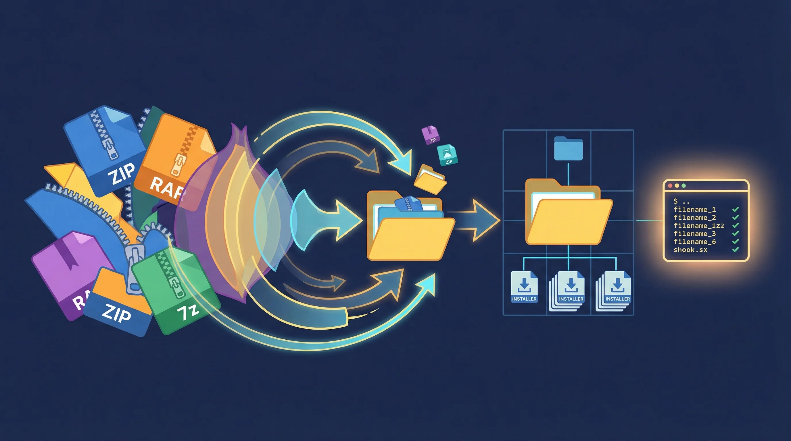

# PeelX



**Recursively extract nested archives and run every installer -- one command, zero hassle.**

---

## How It Works

```
BEFORE                                    AFTER
downloads/                                downloads/
  Gigabyte_LAN_Driver.zip                   Gigabyte_LAN_Driver/
    -> LAN_Driver_v2.1.rar                    setup.exe
        -> setup.exe                          readme.nfo
        -> readme.nfo                       ASUS_Audio_v6.0/
  ASUS_Audio_v6.0.zip                         install.exe
    -> audio_driver.zip                       release.txt
        -> install.exe                      MSI_BIOS_Update/
        -> release.txt                        flash.exe
  MSI_BIOS_Update.7z                          info.nfo
    -> bios_v1.4.rar
        -> flash.exe
        -> info.nfo

  15 archives, nested 2-3 deep              Clean folders, ready to run
  + .sfv, .par2, .r00-.r99 clutter          All archives and junk removed
```

One command:

```
peelx downloads/
```

PeelX extracts every archive (including archives inside archives), cleans up all the leftover archive files, and drops you into an interactive selector where you can run each executable in sequence.

---

## Features

**Recursive nested extraction** -- Archives within archives within archives. PeelX keeps extracting until there is nothing left to unpack, up to 50 levels deep.

**Split archive support** -- Handles multi-part archives (.r00-.r99, .z01-.z99, .001-.999, .7z.001, etc.) automatically. Extracts from the main archive file and cleans up every split part.

**Interactive executable selector** -- After extraction, a curses-based interface shows every executable found across all extracted folders. Navigate with arrow keys, preview NFO/README files in a side panel, run installers directly, and track which ones you have already executed.

**Automatic cleanup** -- Removes all archive files, split parts, checksums (.sfv, .md5, .sha1, .sha256, .crc), and parity files (.par2) after extraction. NFO files and extracted content are preserved.

**Cross-platform** -- Windows, Linux, macOS, and WSL. On WSL, PeelX auto-detects the environment and converts paths so Windows executables launch correctly.

**Safety first** -- Dry-run mode previews every action without touching files. Backup mode copies archives before deletion. A hard limit of 50 extraction iterations prevents runaway loops.

---

## Installation

### From PyPI (recommended)

```bash
# Core install (ZIP, TAR, GZ, BZ2, XZ support built-in)
pip install peelx

# Full install with RAR and 7z support
pip install peelx[all]
```

### Windows Standalone

Download `peelx.exe` from the [Releases](https://github.com/TheDecipherist/PeelX/releases) page. No Python required -- just drop it in your PATH or run it directly.

### From Source

```bash
git clone https://github.com/TheDecipherist/PeelX.git
cd PeelX
pip install -e .[all]
peelx
```

---

## Quick Start

```bash
# Run in the current directory
peelx .

# Run against a specific folder
peelx ~/Downloads/drivers/

# Preview what would happen (no files modified)
peelx ~/Downloads/drivers/ --dry-run

# Detailed output showing every file
peelx ~/Downloads/drivers/ --debug
```

That is it. PeelX scans the target directory, finds every folder containing archives, extracts recursively, cleans up, and launches the interactive selector.

---

## Why PeelX?

You have been there. Everyone has been there.

You just built a new PC, or you are setting up a fresh Windows install, and you head to Gigabyte's support page to grab drivers. Fifteen downloads later, your Downloads folder is full of ZIP files. You open the first one. Inside: another ZIP. Or a RAR. You extract that. Now you have a setup.exe buried two folders deep alongside a pile of .sfv and .r00 files you do not need.

Multiply that by fifteen. That is thirty manual extractions, fifteen rounds of "find the installer," and fifteen cleanup passes to get rid of the archive debris. It is tedious, repetitive, and exactly the kind of thing a script should handle.

This is not just a motherboard driver problem. Firmware updates, game mods, driver packs, software collections -- anything distributed as nested archives hits the same wall. Double-wrapped ZIPs are everywhere.

PeelX was built to make this a one-command operation:

```bash
peelx ~/Downloads/drivers/
```

Every archive extracted. Every nested archive extracted. Every .sfv, .par2, .r00 file cleaned up. Every setup.exe found and presented in a clean interface so you can run them one by one.

---

## Interactive Selector

After extraction, PeelX launches an interactive curses-based UI with two display modes:

### Split-Screen Mode (default)

```
+-------------------------------------------+------------------------+
|  EXECUTABLES                              |  PREVIEW               |
|                                           |                        |
|  [ ] Gigabyte_LAN/setup.exe              |  Release: LAN Driver   |
|  [*] ASUS_Audio/install.exe   (ran 1x)   |  Version: 6.0.1.8     |
|  [ ] MSI_BIOS/flash.exe                  |  Date: 2025-03-15     |
|  [ ] Realtek_WiFi/setup.exe              |                        |
|  [*] NVIDIA_Driver/setup.exe  (ran 1x)   |  Install Notes:        |
|                                           |  Run as administrator  |
|                                           |  Reboot after install  |
+-------------------------------------------+------------------------+
|  Up/Down: Navigate | Enter: Run | q: Quit | Right: Full preview   |
+-------------------------------------------+------------------------+
```

### Full-Screen Preview Mode

Press the right arrow key to expand the preview panel to full screen -- useful for reading longer NFO files. Press left arrow to return to split view.

### Key Features

- **NFO/README auto-detection** -- Finds .nfo, .txt, .diz, and .readme files associated with each executable using priority-based matching (exact name match, common readme filenames, any info file in the same directory, parent directory search).
- **Execution tracking** -- Executables you have already run are highlighted in green with an execution count. State is saved to `executions.log` so it persists across sessions.
- **Multi-encoding support** -- Reads info files with UTF-8, Latin-1, CP437, CP1252, and ISO-8859-1 fallback so NFO art renders correctly.

---

## Supported Formats

| Format | Extensions | Notes |
|--------|-----------|-------|
| ZIP | .zip | Built-in, no dependencies |
| TAR | .tar, .tgz, .tbz2 | Built-in, no dependencies |
| GZ | .gz | Built-in, no dependencies |
| BZ2 | .bz2 | Built-in, no dependencies |
| XZ | .xz | Built-in, no dependencies |
| RAR | .rar, .r00-.r99 | Requires `rarfile` package or system `unrar` |
| 7z | .7z, .7z.001+ | Requires `py7zr` package or system `7z` |

Split archive variants (.r00, .r01, .z01, .z02, .001, .002, etc.) are all detected and handled automatically.

---

## CLI Options

```
peelx [directory] [options]

Positional:
  directory              Directory to scan (default: archives)

Options:
  --dry-run              Preview all actions without extracting or deleting
  --backup               Create backup copies before deleting archives
  --no-interactive       Use simple text menu instead of curses UI
  --debug                Show detailed output with individual file names
  -h, --help             Show help message
```

---

## Building a Windows Executable

PeelX includes a build script that packages everything into a standalone `.exe` using PyInstaller:

```bash
# If installed via pip
peelx-build-exe

# Or from source
python build_exe.py
```

The build script installs any missing dependencies (PyInstaller, rarfile, py7zr, windows-curses) and produces a single-file executable at `dist/peelx.exe`. Must be run on Windows since PyInstaller builds for the current platform.

---

## License

PeelX is released under the [MIT License](LICENSE).
